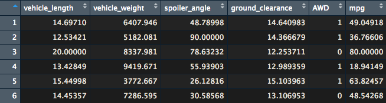
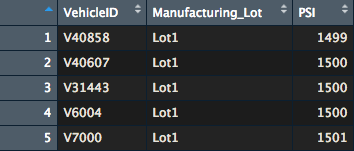
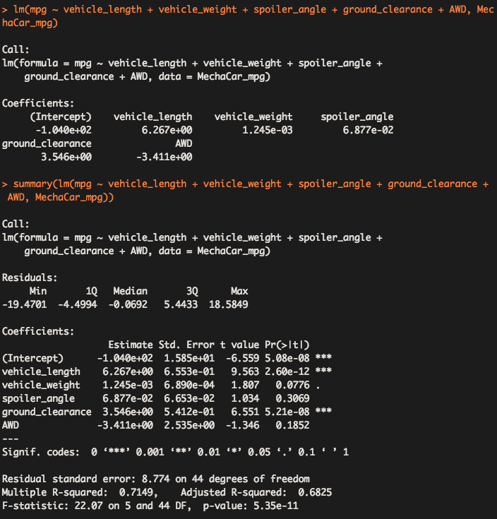
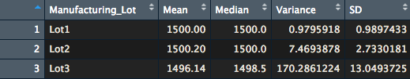
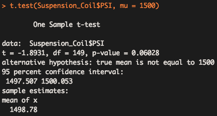
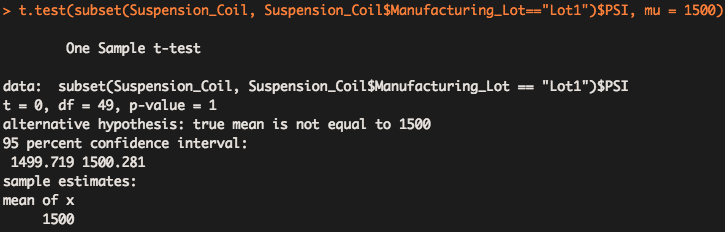
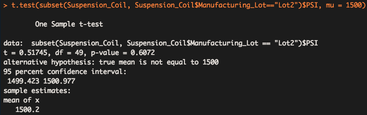
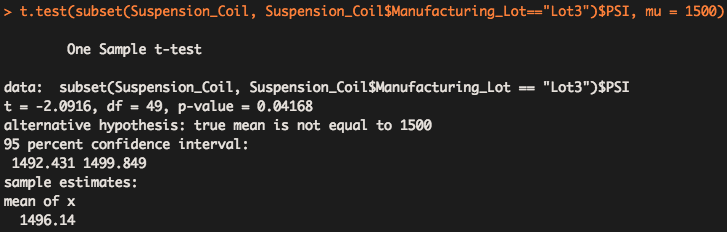

# **MechaCar_Statistical_Analysis**  


## **Overview of Project**
In this project we are performing statistical analyses (linear regression, hypothesis testing ...) to assess the data related to the newest prototype (MechaCar) of a car manufacturing company "AutosRUs".

### **Purpose**
the required data is provided in two files in csv format. The first file has information on the prototype itself and the second one contains data of the test results for weight capacities of multiple suspension coils from different lots. [Fig. 1](Visualizations/data.png) and [Fig. 2](Visualizations/data.png) show a part of these files.
  

<center>

|*Fig. 1*|
:--:
||

<br>

|*Fig. 2*|
:--:
||
</center>
&nbsp;


Using R and its libraries we are trying to design a linear model to predict the MPG for the MechaCar, then we investigate the suspension coils data to see which lot suspension coils  meets the expectations of AutosRUs.
&nbsp;

## **Linear Regression to Predict MPG**  

We set the "mpg" as the dependent variable and all other factors in the provided file as independent variables. in  [Fig. 3](screen_shots/linear_reg.png) you can see the result of this linear model:

<center>

|*Fig. 2: Linear model to predict the MPG*|
:--:
||
</center>
&nbsp;

As you can see in the figure we can write an equation for this linear regression as follows:
&nbsp;

```mpg = 6.27(vehicle_length) + 3.55(ground_clearance) - 3.41(AWD) + 0.07(spoiler_angle) + 0.001 (vehicle_weight) - 104```

The summary statistics shows that the p-value for this model is 5.35e-11 which is much smaller than an assumed significance level of 0.05, so we can reject the null hypothesis which is "the slope of the linear model is zero".  
the most significant independent variables in this linear model are ***"vehicle_length"*** and ***"ground_clearance"*** as they have the lowest p-values according to the summary statistics.  
This model has an R-squared value of 0.7149. that means there is a 70% chance that the predictions for the MPG using this model will be correct, that can be considered a good chance.
&nbsp;

## **Summary Statistics on Suspension Coils**
Using the second dataset that has the information on the test results for weight capacities of multiple suspension coils regarding 3 manufacturing lots we first created a summary statistics table for the whole dataset ([Fig. 4](screen_shots/all_lots_statistics.png)) and then we did the same for each lot in the dataset([Fig. 5](screen_shots/each_lot_statistics.png)):
<center>

|*Fig. 4: Summary statistics for the test results for all 3 manufacturing lots*|
:--:
||

<br>

|*Fig. 5: Summary statistics for the test results for each lot*|
:--:
||
</center>
&nbsp;

knowing that the design specifications for the MechaCar suspension coils dictate that the variance of the produced suspension coils must not exceed 100 pounds per square inch, if we consider the data from 3 lots all together, we can see that the variance of the sample dataset is 62.29 which is acceptable by AutosRUs ([Fig. 4](screen_shots/all_lots_statistics.png)) . But if we look at each lot separately it is obvious that only lots 1 and 2 pass the screening criteria as the products of the manufacturing lot 3 has a variance of 170.3 which does not satisfy the requirements([Fig. 5](screen_shots/each_lot_statistics.png)).
&nbsp;

## **T-Tests on Suspension Coils**

As series of t-tests were performed to determine if all manufacturing lots and each lot individually are statistically different from the population mean of 1500 psi. The results of these t-tests are shown in figures 6 to 9 :

<center>

|*Fig. 6: T-test result for all lots*|
:--:
||

<br>

|*Fig. 7: T-test result for lot 1*|
:--:
||

<br>

|*Fig. 8: T-test result for lot 2*|
:--:
||

<br>

|*Fig. 9: T-test result for lot 3*|
:--:
||
</center>
&nbsp;

The results indicate that only the sample dataset related to lot 3 ([Fig. 9](screen_shots/lot_3_t.png)) is statistically different from the population mean of 1500 psi as the p-value of the test is 0.04 (smaller than an assumed significance level of 0.05), therefor we can reject the null hypothesis.  
Remaining 3 sample datasets regarding all manufacturers ([Fig. 6](screen_shots/all_lot_t.png)), lot 1([Fig. 7](screen_shots/lot_1_t.png)) and lot 2([Fig. 8](screen_shots/lot_2_t.png)) respectively have the p-values of 0.06, 1 and 0.6 which are grater than the significance level of 0.05, as a result, for these datasets we do not have enough evidence to reject the null hypothesis and we should say that they are NOT statistically different from the population mean of 1500 psi.

## **Study Design: MechaCar vs Competition**  

A factor that can be used to evaluate the performance of the MechaCar against the performance of its potential competitors is the MPG. Using this factor we can compare MechaCar with the vehicles in the same class in other brands. To perform this analysis we can 1.put the vehicles belong to the competitor brands, all in one group or 2. have a group of vehicles for each brand, the only difference would be the statistical test we need to run to evaluate whether we can reject our null hypothesis or not. For the two cases we mentioned, respectively, the null hypotheses would be: 1. "there is no statistical difference between the means of two sample datasets", 2. "there is no statistical difference between the means of the groups (MechaCar dataset and the other groups of vehicles belong to the competitor brands)". in the first case we just need to run a two-sample t-test to compare the two groups, but in the case of having the vehicle of each brand in a separate group it's better to carry out an ANOVA test first to confirm if there is any statistical difference between the groups generally, and then if the answer is yes we can run some further tets (for example two-sample t-test for each pair of datasets/groups). But before all this, we need to collect the data for the competing vehicles and make sure that the datasets we have, meet the assumptions of the statistical test we are going to run.


